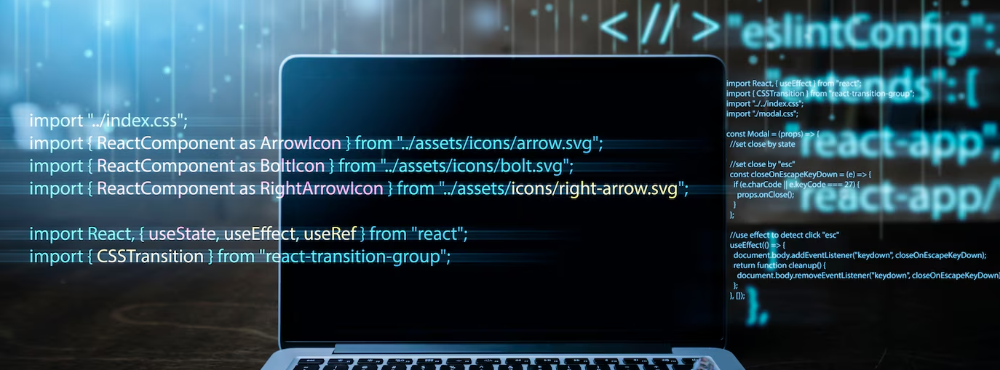

# 👋 Hello there!

I'm a **skilled web developer** who thrives on tackling challenges in any **front-end tech stack**.
Currently, my favorite framework is **Next.js**.

My strong side is crafting **business logic layers** and building robust **project architectures**.
I adhere to **Feature-Sliced Design**, **SOLID principles**, and a **clean code philosophy**.

---

## 📚 My Tech Stack

|     |                  |                                                                                                                                                                                                                                                                                                                                                                                                                                                                                                                                                                                                                                                                                           |
|-----|------------------|-------------------------------------------------------------------------------------------------------------------------------------------------------------------------------------------------------------------------------------------------------------------------------------------------------------------------------------------------------------------------------------------------------------------------------------------------------------------------------------------------------------------------------------------------------------------------------------------------------------------------------------------------------------------------------------------|
| 🌐  | Core web         |                                                                                                                                    |
| 🖥️ | Frontend         |                                                                                                                                                                                                                                                         |
| 🖼️ | Styling          |                                                                                                   |
| 🔄  | State management |                                                                        |
| 🗄️ | Backend          |                                                                                                                                                                                                                                                                                                                                    |
| 🛢️ | Databases        |                                                                                                                                                                                                                                                                                                               |
| ⚙️  | ORM              |                                                                                                                                                                                                                                   |
| 🛠️ | FrontOps         |       |
| ✅   | Testing          |                                                                                                                                                                                |
| ⚡   | CI/CD            |                                                                                                                                                                                                                                                                                                                                                                                                                  |
| 🕒  | Version control  |                                                                                                                                                                                                                                                                                                                                                                        |
| 💳  | Payments         |                                                                                                                                                                                                                                                                                                                                                                                                                                                                                                                                                                                     |

---

💬 **I'm always open to collaborate on exciting projects and solve challenging problems.**
Feel free to reach out and let's build something amazing together!
